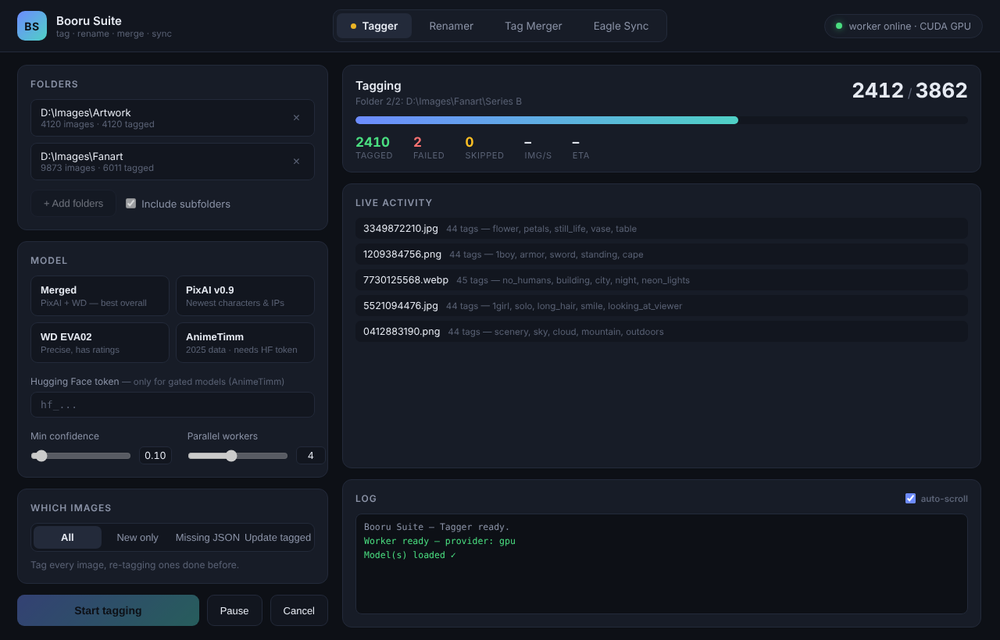
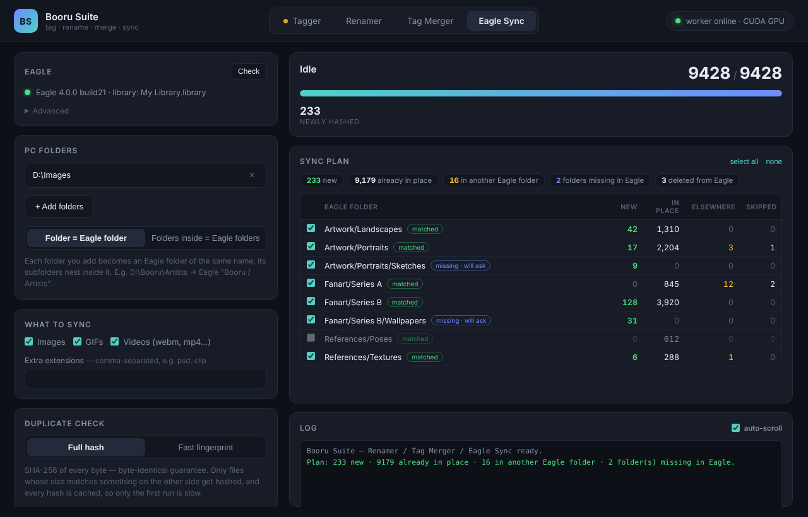

# Booru Suite

Tag your image library with booru-style tags on your GPU, then get it into
[Eagle](https://eagle.cool/) **without duplicates**. Four tools in one app:

| Tab | What it does |
|---|---|
| **Tagger** | GPU tagging with current models (PixAI v0.9, WD EVA02 v3, AnimeTimm, or Merged) → one `Json/<name>.json` per image |
| **Renamer** | Gives images unique, collision-proof 10-digit filenames, with a full old → new history |
| **Tag Merger** | Writes tagger tags into existing Eagle items, with a confidence filter |
| **Eagle Sync** | Mirrors your PC folders into matching Eagle folders by content hash: never duplicates, asks before creating folders, keeps a safety copy, verifies every import byte-for-byte, and can undo |




The Tagger and the Eagle tools run independently, so you can tag one folder
while a sync runs. A pulsing dot on a tab means that tool has a job running.

> **Upgrading from Booru Tagger V3 / Eagle Toolkit?** Booru Suite replaces
> both. On first launch it copies your Eagle Toolkit history (sync hash
> database, import ledger, run journals, rename/merge logs) and reuses your
> existing Tagger Python environment, so there's no CUDA reinstall. The old
> apps are never modified. Folder lists and settings need to be re-entered once.

## Requirements

- **Windows** (the Tagger's GPU setup targets Windows; the Eagle tools are plain Node)
- **Node.js 18+**: only to run from source or build the installer
- **Python 3.9+** ([python.org](https://python.org), tick "Add to PATH"): the
  Tagger creates its own private environment from it on first use
- **NVIDIA GPU** recommended: CUDA installs automatically from pip, no CUDA
  Toolkit needed. AMD/Intel use DirectML; CPU works everywhere.
- **Eagle 4.0 Build 21+** for Eagle Sync's full feature set (older Eagle works
  with reduced features, see below)

## Quick start

```bash
npm install
npm start          # run from source
npm run build      # Windows installer → dist/Booru-Suite-Setup-<version>.exe
```

First Tagger use creates a Python environment and installs the inference
libraries (a few minutes, once). The first tagging run downloads model
weights (~2.5 GB for Merged, once). After that everything runs offline.

## Workflow

1. **Renamer** (optional): give images unique names *before* tagging.
   Renaming after tagging orphans the tag JSONs.
2. **Tagger**: tag new images.
3. **Eagle Sync** (Eagle open): scan → review the plan → import. New images go
   in with their booru tags already attached.
4. **Tag Merger** (Eagle closed): only needed for items that were already in
   Eagle before they were tagged.

---

## Tagger

1. **Add folders** (subfolders optional; `Json/` folders are skipped).
2. **Pick a model:**

   | Model | Data | Tags | Notes |
   |---|---|---|---|
   | PixAI v0.9 | Jan 2025 | ~13.5k | Best recent characters/IPs |
   | WD EVA02 v3 | Feb 2024 | ~10k | Fewest false positives, has `rating:*` tags |
   | AnimeTimm | 2025 | ~12.5k | Gated on Hugging Face, needs a free read token |
   | **Merged** | | | PixAI + WD union, the recommended default |

3. **Which images:**
   - *All*
   - *New only* (skips logged successes)
   - *Missing JSON*
   - *Update tagged* (re-tags only images that already have a JSON, with the selected model)
4. **Start.** Progress, rate and ETA are live; pause/cancel any time.

Output per image: `<folder>/Json/<name>.json` as
`[{"filename": ..., "tags": {"tag": confidence}}]`, plus NDJSON entries in
`<folder>/Json/processed_log.json`. Tag files are written atomically.

**Parallel workers:** how many images are in flight at once (decode and
preprocess run in parallel; the GPU pipelines inference). 4 is a good
default.

**GPU notes:**
- **NVIDIA:** setup detects the GPU (`nvidia-smi`) and installs the CUDA
  runtime from pip. All models run on the GPU, PixAI included.
- **AMD/Intel:** DirectML. Under DirectML, PixAI falls back to CPU (its graph
  is DirectML-incompatible; results are still correct).
- **Forcing a backend:** set the `ONNX_MODE` env var (`gpu`, `dml`, `cpu`).
  The pill in the header shows the active one.

**Gated models (AnimeTimm):**
1. Create a free Hugging Face account.
2. Accept the model's terms on its page.
3. Create a **Read** token under Settings → Access Tokens.
4. Paste it into the HF token field.

The token is stored locally and only sent to Hugging Face.

**Adding models:** add a function returning `{tag: score}` to the `MODELS`
registry in `worker/worker.py`, and a matching `.model-opt` card in
`renderer/index.html`.

## Renamer

Gives every image a random, globally unique 10-digit name (extension kept)
so filenames work as stable IDs for tagging and Eagle matching.

- **Skipped:** files already named with 10 digits, files renamed in an earlier
  run, and non-images (detected by file content, not extension).
- **Collision-proof:** names are reserved in memory *and* checked against the disk.
- **History:** every rename is recorded (old → new) in `rename_history.ndjson`.

## Tag Merger

Matches tag JSONs to Eagle items by filename and merges the tag names into
each item's `metadata.json`.

- **Min tag confidence** (default 0.35) keeps low-confidence noise out of Eagle.
- **Modes:** *All items*, or *New only* (skips already-merged items, which
  also resumes a cancelled run).
- **Safe writes:** temp file, then swap. Only item metadata (`<id>.info/metadata.json`)
  is touched, never the library's folder tree.
- **Eagle open?** Close Eagle before merging, or re-sync the library
  afterwards; Eagle caches metadata in memory.

## Eagle Sync

A one-way PC → Eagle mirror that **doesn't use Eagle's auto-import** and
**never duplicates** anything. Eagle must be running (it uses Eagle's local API).

1. **Add PC folders** and choose the mapping:
   - *Folder = Eagle folder*: `D:\Images` → Eagle `Images`, with its subfolders
     nested inside.
   - *Folders inside = Eagle folders*: `D:\Images` is just a container, so
     `D:\Images\Fanart` → Eagle `Fanart`.

   Folders match by **exact path** (case-insensitive), never by a folder
   with the same name somewhere else.
2. **Scan & preview** changes nothing. It shows each folder's new files, files
   already in place, files in Eagle under a different folder, and skipped
   files. Untick anything you don't want.
3. **Import**: if folders are missing in Eagle it **asks first**, then creates
   them with the same names and nesting, and imports.

### How duplicates are ruled out
- **Size pre-filter:** identical files have identical sizes, so a file whose
  size doesn't exist on the other side is new without reading it.
- **Content hash** for every size collision, on both sides:
  - *Full hash*: SHA-256 of every byte.
  - *Fast fingerprint*: size + first and last 256 KB, for HDDs and big videos.
- **Unreadable files are never imported blind.** If a file is locked or
  cloud-only during a scan, it's listed as "couldn't verify" and left out.
- **Hash database:** cached by path, size and modified-time, so only the first
  scan is slow. Renaming files doesn't cause re-imports, because matching is
  by content.
- **Import ledger:** files you delete from Eagle aren't re-imported unless you
  tick *Re-import files I've deleted from Eagle*. An import only counts once
  it's verified in Eagle, so an import that Eagle never finished is retried.
- **Duplicates on your PC** are imported once.

### Safety
- Eagle **copies** files into its library. Your PC files are never modified,
  moved or deleted, and deleting in Eagle never touches your PC.
- **Safety copy** (on by default): each new file is copied to
  `Eagle Sync Backup\<date time>\…` and hash-checked, then **Eagle imports
  from the copy**, so your originals are never handed to Eagle. Each run gets
  a `manifest.csv`. The free-space check runs before anything changes.
- **Verification:** every imported file inside the Eagle library is compared
  byte-for-byte with the original. Eagle copies in the background, so the
  check waits for it. *Verify last sync* re-checks a run later and tells you
  when the backup is safe to delete.
- **Undo last sync** reverses a run:
  - removes the folder assignments it added;
  - moves its imports to Eagle's trash, where they can be restored;
  - lists the folders it created.

  Every run keeps a journal of its changes, and closing the app mid-import
  finishes the current batch first.
- **Pause and Cancel** work in every phase.

### Options
- **File existing items into the matching folder:** an item already in Eagle
  under another folder is added to the matching folder too. No copy is made.
- **Attach booru tags** from the Tagger's `Json/` files on import, filtered by
  confidence.
- **What to sync:** images, GIFs, videos (webm, mp4, mov, mkv…), plus extra
  extensions.

### Older Eagle
Eagle below 4.0 Build 21 uses the V1 API. Set the library path under
*Advanced*. Filing existing items, per-item verification and Undo aren't
available there.

---

## Where data lives

Everything goes in `%APPDATA%\booru-suite`, shared by `npm start` and the
installed app:

- settings
- the Eagle Sync hash database (`eagle_sync_hashes.json`), import ledger
  (`eagle_sync_ledger.ndjson`) and run journals (`eagle_sync_runs\`)
- Renamer and Merger logs

Tagger output stays next to your images (`Json\`). Python environments live
in the app data folder too, or the existing Tagger V3 environment is reused.

## Troubleshooting

- **"Python not found":** install Python 3.9+ with "Add to PATH", then
  restart the app.
- **Worker pill says CPU on an NVIDIA machine:** the CUDA install failed;
  check the setup log. DirectML or CPU still work, just slower.
- **Eagle Sync says Eagle isn't reachable:** open Eagle, then press *Check*.
  For a remote Eagle, set the address and API token under *Advanced*.
- **Merged tags don't show in Eagle:** Eagle was open and re-saved its cached
  metadata. Close Eagle and merge again (*New only* makes that cheap).
- **The merger finds no match:** the image's filename changed after tagging.
  The JSON's base name must match the image's.

## Project layout

```
main.js              Window, shared dialogs, app lifecycle
preload.js           window.api (Tagger) + window.tk (Eagle tools)
lib/ipcTagger.js     Tagger IPC + Python worker orchestration
lib/ipcToolkit.js    Renamer / Merger / Sync IPC (channels prefixed tk:)
lib/dataRoot.js      Data folder + one-time migration from the old apps
lib/pythonEnv.js     Python environment setup / reuse
lib/worker.js        Python worker process + stdio protocol
lib/scanner.js       Tagger folder scan + processed_log
lib/renamer.js       Renamer
lib/merger.js        Tag Merger
lib/sync.js          Eagle Sync engine (scan, plan, import, verify, undo)
lib/eagleApi.js      Eagle local API client (V2, V1 fallback)
lib/hashdb.js        Cached content hashes
lib/walk.js          Shared fs helpers
worker/              Python inference worker + requirements
renderer/            shell (header/tabs) + tagger.* + toolkit.*
```

**Releases:** bump `"version"` in `package.json`, add a `## Booru Suite — x.y.z`
section to `CHANGELOG.md`, then create tag `vX.Y.Z` (e.g. via *Draft a new release*
on GitHub). The Release action builds the installer and publishes the release.

See [CHANGELOG.md](CHANGELOG.md) for version history. Earlier versions
(Booru Tagger V3, the standalone Eagle Toolkit, and the Docker-based V2) live
in this repository's history.
